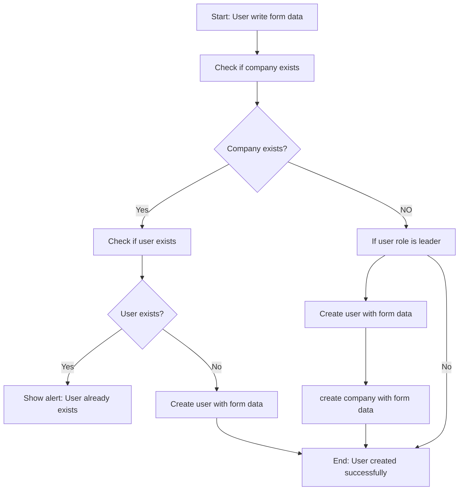
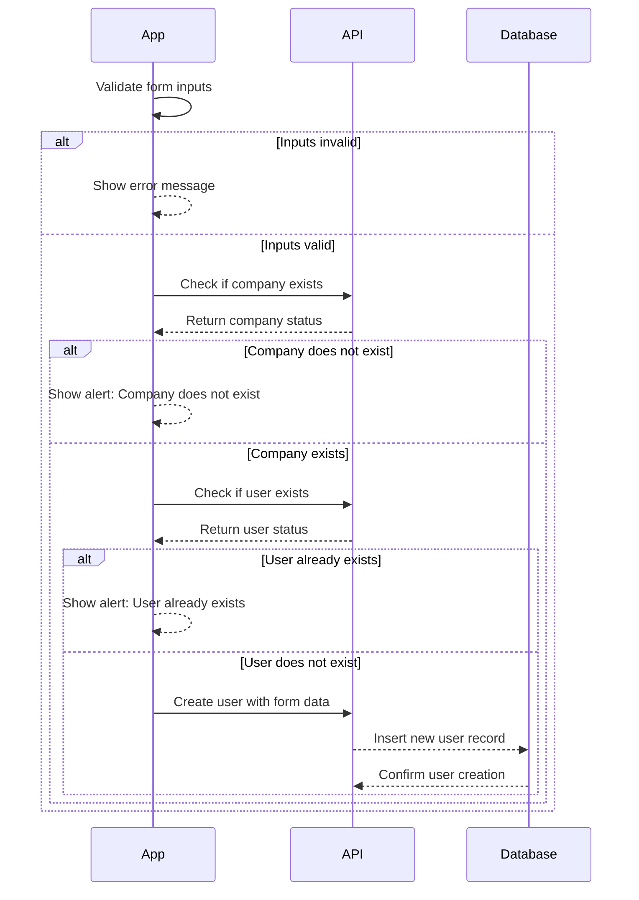

## Sign-up Flow – Dokumentasjon

Denne filen dokumenterer registreringsflyten for applikasjonen. Den er ment som et hjelpemiddel for å forstå hvordan brukere registrerer seg.

Filen inkluderer to visualiseringer:
1. **Flytskjema**: Viser de overordnede trinnene i registreringsprosessen.

2. **Sekvensdiagram**: Viser detaljene i registreringsprosessen, inkludert interaksjoner mellom applikasjonen, API-et og databasen.

